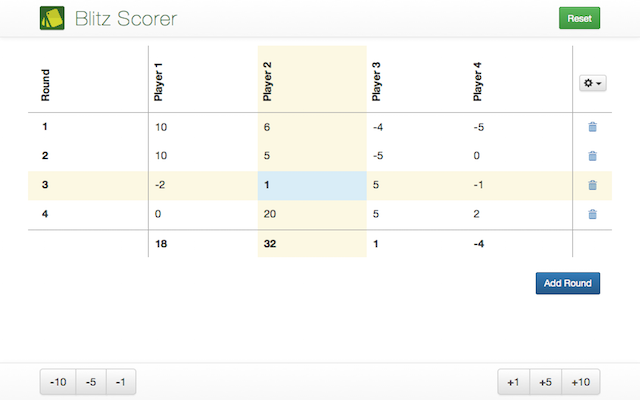

# blitzscorer-phonegap

An unofficial scoring app for the Dutch Blitz card game.

 - Up to 8 players.
 - Record scores for each round.  Totals shown at bottom.
 - Simple +1, +5, +10, and -1, -5, -10 buttons for adjusting score.

Don't want to install the app? Use the fully functional web version at [blitzscorer.com](http://blitzscorer.com/).

## Purpose of this app
The primary purpose I wrote this app is because I wanted to try and write a simple app that worked great on all platforms in Cordova.  And, a Dutch Blitz scoring app is something that I will use!  I was hoping to be able to use a single code base to publish to Android, iOS, OS X, Windows Desktop, and the web.  Firefox and Windows phones would be nice but not required.  I'm close, but [cordova-osx](https://github.com/apache/cordova-osx) doesn't appear to work.

## Get the app!
So far, the app has been published on a number of different stores.  Links to listings:

 - [Webapp](http://blitzscorer.com/) Any modern browser / platform.
 - [Google Play (Android)](https://play.google.com/store/apps/details?id=com.blitzscorer)
 - [Apple App Store](https://itunes.apple.com/us/app/blitz-scorer/id1016406103?ls=1&mt=8) (Waiting for review)
 - [Windows Phone Store](https://www.windowsphone.com/en-au/store/app/blitz-scorer/cf4c70eb-63a1-4eea-a98d-de101e57542d) (I haven't been able to test this yet, as I don't have a Windows phone)
 - [Firefox Marketplace](https://marketplace.firefox.com/app/blitzscorer/) (Waiting for review) FirefoxOS, Mac + Windows + Windows Desktop, & Android (Requires Firefox Installed)
 - [Chrome Web Store](https://chrome.google.com/webstore/detail/blitz-scorer/ihdhajnfhcngffceogmhmbmkmhlanmab) - ChromeOS, Windows + Mac desktops.
 
## Using this code
Go for it!  I'm not bothered what anybody uses this code for.  How do you use it?  Well, check out the Cordova Doc's.  The project is pretty stanard.
